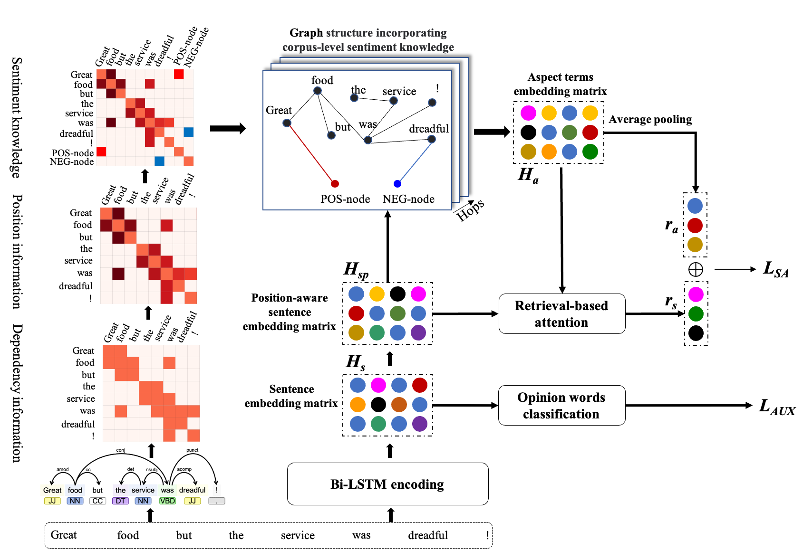

# **SEGCN-ABSA**

Code for Paper "Store, share and transfer: Learning and updating sentiment knowledge for aspect-based sentiment analysis"

*Information Sciences*,2023,Volume 635,Pages 151-168

Yongqiang Zheng,Xia Li and Jian-Yun Nie

## **Model**


## **Requirements**
- python==3.7.13
- torch==1.11.0+cu113
- transformers==4.2.2
- scikit-learn==1.0.2

## **Datasets**
Download datasets from these links and put them in the corresponding folder:
- [Twitter](https://goo.gl/5Enpu7)
- [Lap14](https://alt.qcri.org/semeval2014/task4)
- [Rest14](https://alt.qcri.org/semeval2014/task4)
- [Rest15](https://alt.qcri.org/semeval2015/task12/)
- [Rest16](https://alt.qcri.org/semeval2016/task5/)

## **Usage**
1. Download GloVe vectors
```
mkdir preprocess
wget https://nlp.stanford.edu/data/glove.840B.300d.zip
unzip glove.840d.300d.zip
mv glove.840d.300d.zip preprocess/
rm glove.840d.300d.zip
```
2. Download Bing Liu's opinion lexicon
```
wget -O lexicon.tar.gz http://www.cs.uic.edu/\~liub/FBS/opinion-lexicon-English.rar
mkdir lexicon
tar -xzvf lexicon.tar.gz -C lexicon/ --strip-components 1
rm lexicon.tar.gz
```
3. Generate sentiment-enhanced graph
```
python graph.py
```

## **Training**
```
bash train.sh
```

## **Credits**
The code in this repository is based on [ASGCN](https://github.com/GeneZC/ASGCN).

## **Citation**
```bibtex
@article{ZHENG2023151,
    title = {Store, share and transfer: Learning and updating sentiment knowledge for aspect-based sentiment analysis},
    author = {Yongqiang Zheng and Xia Li and Jian-Yun Nie},
    journal = {Information Sciences},
    volume = {635},
    pages = {151-168},
    year = {2023},
    issn = {0020-0255},
    doi = {https://doi.org/10.1016/j.ins.2023.03.102},
    url = {https://www.sciencedirect.com/science/article/pii/S0020025523004279},
}
```
